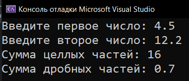
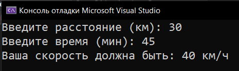
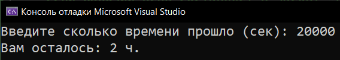
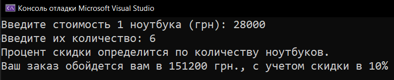
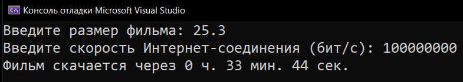

# Homework_4_Converting-Types
Д/з: Converting types

<a href="https://gist.github.com/SlavikArt/5feab4d43a03c079d5bfb4b58478b69f">Gist - страница со всеми кодами проектов</a>

* [Sum_Of_Int_And_Float_Parts](Sum_Of_Int_And_Float_Parts)
* [Calculate_Speed](Calculate_Speed)
* [How_Long_Until_You_Go_Home](How_Long_Until_You_Go_Home)
* [Discount_Laptop_Price](Discount_Laptop_Price)
* [Torrent_Time_Tracker](Torrent_Time_Tracker)

  <h2>Sum of int and float parts</h2>
  
Сумма целых и дробных частей 2-х чисел.

  
  <h2>Calculate speed</h2>
  
Рассчитать скорость.

  
  <h2>How long until you go home</h2>
  
Рассчитать время до конца рабочего дня.

  
  <h2>Discount laptop price</h2>
  
Сколько стоит заказ с учетом скидки.

  
  <h2>Torrent time tracker</h2>
  
За сколько времени скачается фильм.

  

